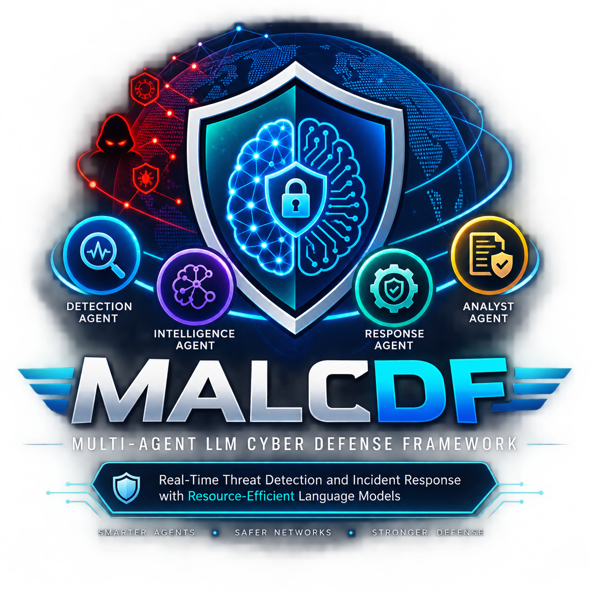

# MALCDF — Multi-Agent LLM Cyber Defense Framework

> A research prototype for real-time cybersecurity threat detection and
> incident response using a multi-agent language-model architecture.

>the project aims to implement research paper [MALCDF: A Distributed Multi-Agent LLM Framework for Real-Time Cyber](https://arxiv.org/abs/2512.14846)

## Project Description

MALCDF implements a multi-agent cybersecurity architecture consisting of:

1. Threat Detection Agent (TDA)
2. Threat Intelligence Agent (TIA)
3. Response Coordination Agent (RCA)
4. Analyst Agent (AA)

The system is designed to process cybersecurity events, identify potential
threats, enrich them with cybersecurity intelligence, map them to MITRE
ATT&CK techniques, generate response recommendations, and produce analyst-
oriented incident reports.

## System Architecture

Network Traffic
      ↓
Network Sensor
      ↓
Flow Builder
      ↓
Fast Threat Detector
      ↓
Suspicious Event
      ↓
Threat Detection Agent
      ↓
Threat Intelligence Agent
      ↓
MITRE ATT&CK
      ↓
Response Coordination Agent
      ↓
Analyst Agent
      ↓
Incident Database
      ↓
SOC Dashboard
